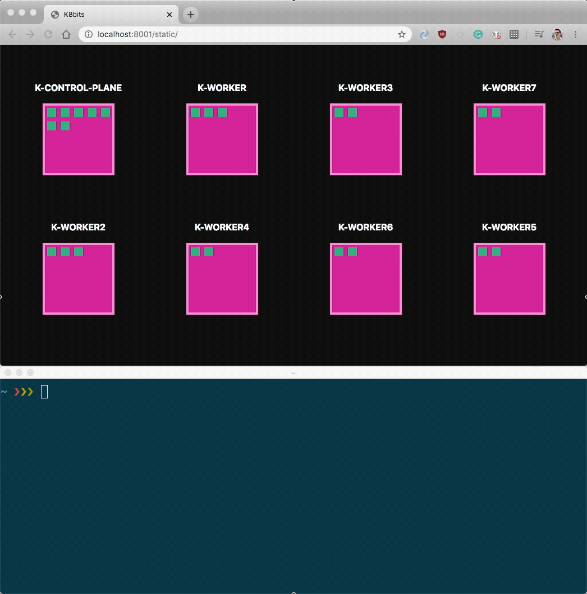

# K8bit — the tiny Kubernetes dashboard

K8bit is a tiny dashboard that is meant to demonstrate how to use the Kubernetes API to watch for changes.



## Usage

You can start the dashboard with:

```bash
$ kubectl proxy --www=.
Starting to serve on 127.0.0.1:8001
```

Open the following URL <http://127.0.0.1:8001/static>.

## Related

This project is inspired by [kube-ops-view](https://github.com/hjacobs/kube-ops-view), which is a fully featured dashboard for Kubernetes.